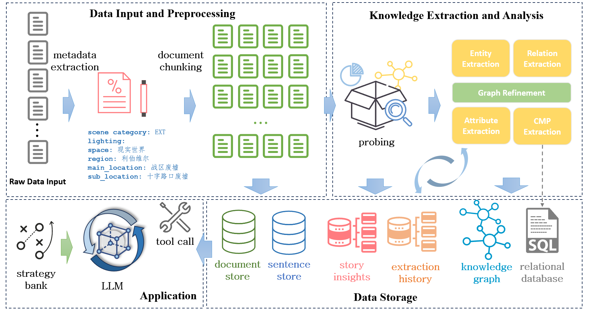
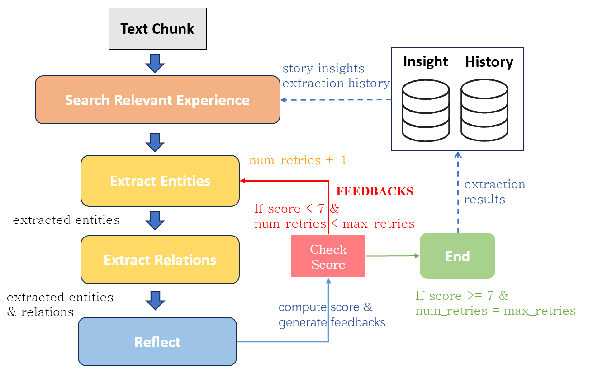
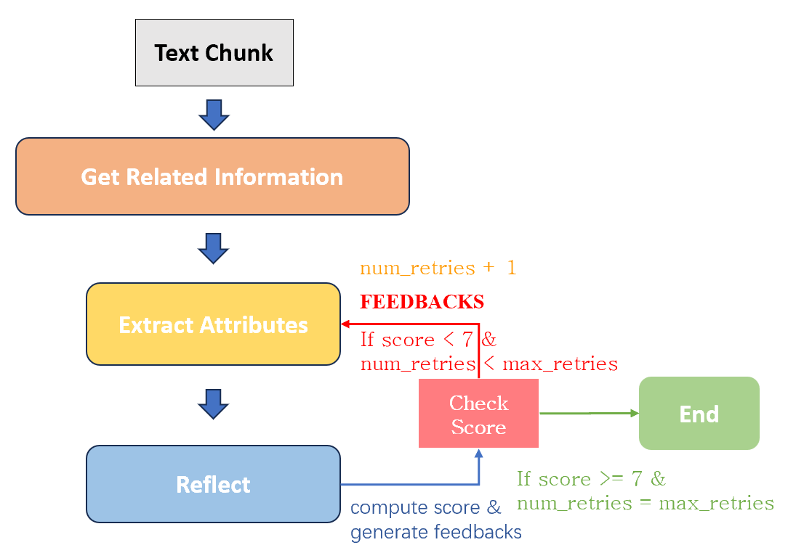
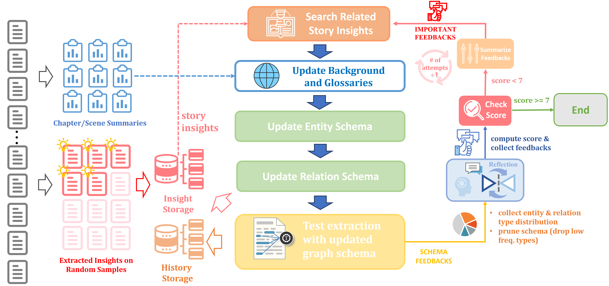

# Narrative Knowledge Weaver: A Multi-Agent Framework for Knowledge Graph Construction and Narrative Analysis

**Narrative Knowledge Weaver**是一个基于大语言模型的智能知识图谱构建与叙事分析系统。该系统能够从非结构化的叙事文本（如小说、剧本）中自动抽取实体、关系和属性，构建结构化的知识图谱，并进一步分析事件因果关系和情节结构，生成事件因果图谱和情节单元图谱。我们在系统中设计了一个 问答智能体，其核心能力是能够根据用户问题的语义特征，自动选择并调用合适的工具（图数据库、向量数据库或关系数据库），并在必要时进行多源结果融合。该机制使系统能够在结构化推理、语义证据回链与属性型查询之间实现灵活切换，从而生成既逻辑严谨又具备原文支撑的回答。

此外，系统还集成了一个 **面向叙事文本的问答模块**。该模块通过统一调度 **图数据库（Neo4j）**、**向量数据库（ChromaDB）** 与 **关系数据库（SQL｜服化道）**，实现对复杂问题的多模态解答。其核心机制是以 **混合模式（Hybrid）** 为默认策略：

* **图数据库** 提供事件因果链、人物关系和情节结构的推理；
* **向量数据库** 提供对白与叙事描写的语义检索与原文证据回链；
* **关系数据库** 提供服饰、造型与道具等属性信息的规范化查询。

问答代理能够根据用户问题自动组合这些工具，给出既有 **结构化结论** 又有 **原文证据** 的答案。


## 核心特性

- **智能知识抽取**：基于大语言模型自动抽取实体、关系和属性
- **多层次图谱构建**：构建知识图谱、事件因果图谱和情节单元图谱
- **多智能体协作**：采用多智能体系统，各司其职，协同工作
- **反思优化机制**：内置质量评估和反思机制，迭代优化抽取结果
- **多模型支持**：支持OpenAI、Qwen等多种大语言模型
- **高性能处理**：支持多线程并行处理，适合大规模文档
- **灵活配置**：通过YAML配置文件灵活配置各种参数
- **多种存储后端**：支持Neo4j图数据库和ChromaDB向量数据库

## 系统架构

系统采用模块化设计，主要包含以下核心模块：



## 多智能体系统
### Information Extraction Agent
用于抽取实体和关系



**工作流程架构：**
1. **经验检索** ：调用语义记忆系统，检索历史中与当前输入相似的问题与建议，提升提示上下文的针对性
2. **实体抽取** ：使用语言模型从文本中抽取结构化实体，支持8种核心实体类型（Character、Event、Action、Location、Object、Concept、Emotion、Goal、TimePoint）
3. **关系抽取**：基于已有实体与关系类型定义，从文本中识别实体之间的语义关系，支持角色关系、事件动作关系、场景关系等多种关系类型
4. **反思评估**：结合当前抽取结果与日志生成过程，评估抽取质量，返回评分与反思建议

属性抽取与服化道信息抽取也基于类似的抽取-> 反思 -> 优化的流程。

### Attribute Extraction Agent
AttributeExtractionAgent是系统中专门负责实体属性抽取的核心组件。



### Graph Probing Agent
主要目标是确保知识图谱的 schema 结构能够与文本内容和用户需求高度契合，从而支撑不同层面的分析与推理任务



**预准备步骤** 在进入 schema 探测之前，系统会先执行一个 **阅读洞见抽取**: **随机抽取约 35% 的文本块**，进行快速阅读与语义分析。

在实际运行中，Graph Probing Agent 采用 **循环式工作流**：
1. **经验检索**：从记忆库中检索相关案例和洞见，作为 schema 优化的参考。
2. **背景信息生成/调整**：根据洞见，生成/优化背景信息和术语列表。
3. **Schema 生成/调整**：结合背景信息与用户 goals，生成新的实体 Schema，然后以此为基础生成新的关系Schema。
4. **抽取测试**：用已有的背景信息和术语列表构建系统提示词，然后基于候选 schema 在部分文本上进行试验性抽取，验证覆盖度与可行性。
5. **修剪优化**：根据统计分布与任务目标，删除冗余或低频类型，保持 schema 的精炼性。
6. **反思迭代**：评估当前 schema 的质量与目标匹配度，若不足则进入下一轮优化。

### 核心目录结构

```
core/
├── agent/                    # 智能体模块
│   ├── attribute_extraction_agent.py   # 属性抽取智能体
│   ├── knowledge_extraction_agent.py          # 知识图谱抽取代理
│   ├── graph_probing_agent.py           # 探测器智能体
|   ├── retriever_agent.py              # 信息检索智能体
│   └── cmp_extraction_agent.py           # 服化道抽取智能体
├── builder/                  # 构建器模块
│   ├── manager/                        # 构建管理器
│   ├── document_processor.py           # 文档处理器
│   ├── graph_builder.py                # 图谱构建器
│   ├── database_builder.py             # 关系型数据库构建器
│   ├── graph_preprocessor.py           # 图预处理器
│   ├── narrative_graph_builder.py      # 叙事图构建器
│   └── reflection.py                   # 反思模块
├── functions/                # 功能函数模块
├── memory/                   # 记忆模块
├── model_providers/          # 模型提供者
├── models/                   # 模型定义
├── prompts/                  # 提示词模板
├── schema/                   # 数据模式定义
├── storage/                  # 存储模块
└── utils/                    # 工具函数
```

## 快速开始

### 环境要求

- Python 3.10+
- Neo4j 5.x
- 足够的内存和计算资源（推荐16GB+内存）

### 安装步骤

1. **克隆项目**
```bash
git clone https://github.com/roytian1992/NarrativeKnowledgeWeaver.git
cd NarrativeKnowledgeWeaver
```

2. **安装Python依赖**
```bash
# 使用pip安装
pip install -r requirements.txt

# 或使用conda安装
conda env create -f environment.yml
conda activate kgag
```

3. **安装和配置Neo4j**
```bash
# Ubuntu/Debian系统
sudo apt update && sudo apt upgrade -y
sudo apt install wget apt-transport-https gnupg lsb-release -y

# 添加Neo4j官方源
wget -O - https://debian.neo4j.com/neotechnology.gpg.key | sudo gpg --dearmor -o /usr/share/keyrings/neo4j.gpg
echo "deb [signed-by=/usr/share/keyrings/neo4j.gpg] https://debian.neo4j.com stable latest" | sudo tee /etc/apt/sources.list.d/neo4j.list

# 安装Neo4j
sudo apt update
sudo apt install neo4j -y

# 安装GDS插件
cd /var/lib/neo4j/plugins/
sudo wget https://graphdatascience.ninja/neo4j-graph-data-science-2.20.0.zip
sudo unzip neo4j-graph-data-science-2.20.0.zip

# 配置Neo4j
sudo nano /etc/neo4j/neo4j.conf
# 添加以下配置：
# dbms.security.procedures.unrestricted=gds.*
# dbms.security.procedures.allowlist=gds.*

# 启动Neo4j服务
sudo systemctl enable neo4j
sudo systemctl start neo4j
```

### 配置文件设置

基于提供的配置文件模板创建您的配置：

```yaml
# 知识图谱构建器配置
knowledge_graph_builder:
  prompt_dir: ./core/prompts
  doc_type: "screenplay"  # 或 "novel"
  max_workers: 32

# 事件情节图构建器配置
event_plot_graph_builder:
  max_workers: 32
  max_depth: 2
  check_weakly_connected_components: True
  min_connected_component_size: 10
  max_num_triangles: 2000
  max_iterations: 5
  min_confidence: 0.0
  event_fallback: [Action, Goal]

# 探测配置
probing:
  probing_mode: adjust  # fixed/adjust/from_scratch
  refine_background: False
  max_workers: 32
  max_retries: 2
  experience_limit: 100
  relation_prune_threshold: 0.01
  entity_prune_threshold: 0.02

# 大语言模型配置
llm:
  provider: openai
  model_name: Qwen3-235B-A22B-FP8  # 或其他支持的模型
  api_key: your-api-key
  base_url: http://your-api-endpoint/v1
  temperature: 0.0
  max_tokens: 8096
  enable_thinking: True
  timeout: 60

# 图嵌入配置
graph_embedding:
  provider: openai
  model_name: bge-m3
  base_url: http://localhost:8080/v1
  dimensions: 1024

# 向量数据库嵌入配置
vectordb_embedding:
  provider: openai
  model_name: Qwen3-Embedding-8B
  base_url: http://localhost:8009/v1
  dimensions: 1024

# 重排序配置
rerank:
  provider: cohere
  model_name: Qwen3-Reranker-8B
  base_url: http://localhost:8012/v1

# 文档处理配置
document_processing:
  chunk_size: 500
  chunk_overlap: 0
  max_workers: 32
  max_segments: 3
  max_content_size: 2000

# 智能体配置
agent:
  max_workers: 32
  score_threshold: 7
  max_retries: 2
  async_timeout: 600
  async_max_attempts: 3
  async_backoff_seconds: 60

# 记忆配置
memory:
  enabled: true
  memory_type: vector
  max_token_limit: 4000
  memory_path: ./data/memory
  history_memory_size: 3
  insight_memory_size: 10

# 存储配置
storage:
  neo4j_uri: bolt://localhost:7687
  neo4j_username: neo4j
  neo4j_password: your-password
  vector_store_type: chroma
  vector_store_path: data/vector_store
  document_store_path: data/document_store
  knowledge_graph_path: data/knowledge_graph
  graph_schema_path: data/graph_schema
  sql_database_path: data/sql
```

## 使用方法

### 基本用法

```bash
# 处理剧本文档
python main.py \
    -c configs/config_openai.yaml \
    -i examples/documents/流浪地球2剧本.json \
    -v

# 处理小说文档
python main.py \
    -c configs/config_openai.yaml \
    -i examples/documents/我机器人.json \
    -v
```

### 命令行参数说明

| 参数 | 类型 | 必需 | 说明 |
|------|------|------|------|
| `-c, --config` | str | 是 | 主配置文件路径（YAML格式） |
| `-i, --input` | str | 是 | 输入文档路径（JSON格式） |
| `-b, --build-settings` | str | 是 | 构建流程设置文件路径 |
| `-v, --verbose` | flag | 否 | 启用详细日志输出 |

## 核心工作流程

系统的处理流程包括以下主要阶段：

1. **配置加载**：加载YAML配置文件，初始化各种组件
2. **文档预处理**：加载JSON格式的输入文档，进行文本分块和元数据生成
3. **知识抽取**：
   - 使用KG抽取代理提取实体和关系
   - 使用属性抽取代理丰富实体属性
   - 通过反思机制优化抽取质量
4. **图预处理**：实体消歧、聚类和合并
5. **图谱构建**：将抽取结果构建为Neo4j知识图谱
6. **事件因果分析**：分析事件间的因果关系，构建事件因果图
7. **情节结构分析**：识别情节单元，构建情节图谱
8. **向量化存储**：生成向量嵌入，存储到ChromaDB

## 输出结果

系统会生成以下类型的输出：

- **Neo4j知识图谱**：包含实体、关系和属性的结构化图数据
- **事件因果图谱**：展示事件间因果关系的有向图
- **情节单元图谱**：反映叙事结构的高层次图谱
- **向量索引**：支持语义搜索的向量表示
- **处理日志**：详细的处理过程和质量评估信息

## 应用场景

- **人文研究**：大规模文学作品分析和模式发现
- **内容分析**：媒体内容的结构化分析和理解
- **智能问答**：基于叙事内容的智能问答系统
- **创作辅助**：为创作者提供故事结构分析和建议
- **教育工具**：帮助学生理解复杂叙事结构

## 技术特点

- **多智能体架构**：不同代理专门负责不同的抽取任务
- **反思机制**：通过质量评估和反思提高抽取准确性
- **并行处理**：支持多线程并行处理，提高处理效率
- **模块化设计**：易于扩展和维护的模块化架构
- **多模型支持**：支持多种大语言模型和嵌入模型


## 许可证

本项目采用MIT许可证 - 详见[LICENSE](LICENSE)文件

## 贡献

欢迎贡献代码！请查看[贡献指南](CONTRIBUTING.md)了解详细信息。

## 支持

- **问题反馈**：[GitHub Issues](https://github.com/roytian1992/NarrativeKnowledgeWeaver/issues)
- **讨论交流**：[GitHub Discussions](https://github.com/roytian1992/NarrativeKnowledgeWeaver/discussions)

## 致谢

感谢 **《流浪地球3》剧组** 提供算力支持与剧本问答数据标注。

