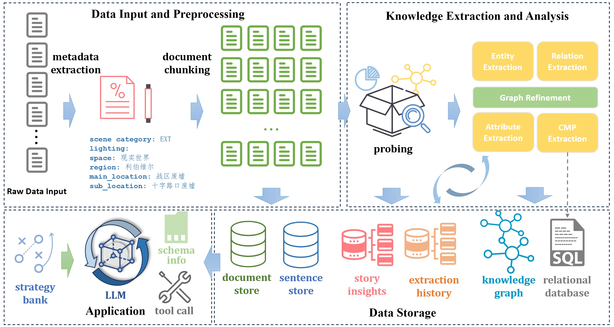
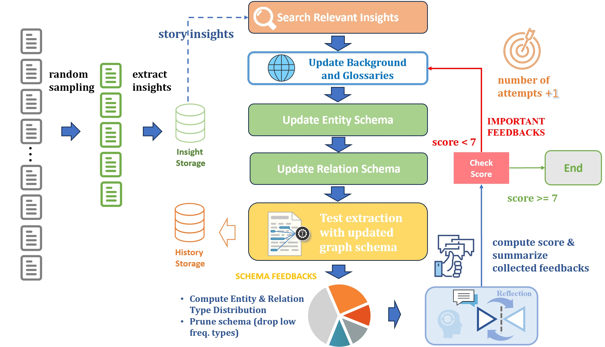

# Narrative Knowledge Weaver: A Multi-Agent Framework for Knowledge Graph Construction and Narrative Analysis

**Narrative Knowledge Weaver** is a large-language-model–powered system for building knowledge graphs and analyzing narratives from unstructured texts (e.g., novels, screenplays). It automatically extracts entities, relations, and attributes to construct a structured knowledge graph; then it infers event causality and plot structure to produce an **Event Causality Graph** and a **Plot Unit Graph**.

A **QA Agent** is included to answer user questions by **selecting and invoking the right tools**—graph DB, vector DB, or relational DB—and fusing multi-source results when needed. This lets the system fluidly switch between **structured reasoning**, **text-grounded evidence retrieval**, and **attribute-style lookups**, producing answers that are both logically sound and grounded in the source text.

In addition, the system provides a **QA module for narrative texts**. By orchestrating **Neo4j (graph DB)**, **ChromaDB (vector DB)**, and **SQL (costume/prop DB)**, it uses **Hybrid mode** by default:

* **Graph DB** for reasoning over event causal chains, character relationships, and plot structures  
* **Vector DB** for semantic retrieval of dialogues and narrative descriptions with evidence tracing  
* **Relational DB** for normalized lookups of costume, makeup, and props  

The QA agent can automatically compose these tools to generate answers that include both **structured conclusions** and **textual evidence**.

---

## Key Features

- **Intelligent Knowledge Extraction**: automatic entity, relation, and attribute extraction via LLMs  
- **Multi-layer Graph Construction**: builds knowledge, event-causality, and plot-unit graphs  
- **Multi-Agent Collaboration**: specialized agents work together in a coordinated workflow  
- **Reflection Mechanism**: built-in evaluation and feedback loops to iteratively refine results  
- **Multi-Model Support**: supports OpenAI, Qwen, and other LLM providers  
- **High-Performance Processing**: multi-threaded parallelism for large-scale documents  
- **Flexible Configuration**: YAML-based, easy to adjust parameters  
- **Multiple Storage Backends**: supports Neo4j and ChromaDB  

---

## System Architecture



---

## Multi-Agent System

### Information Extraction Agent
Extracts entities and relations.


**Workflow:**
1. **Experience Retrieval**: query semantic memory for similar past cases and suggestions  
2. **Entity Extraction**: identify structured entities (Character, Event, Action, Location, Object, Concept, Emotion, Goal, TimePoint)  
3. **Relation Extraction**: detect semantic links such as role relationships, event–action ties, and scene relations  
4. **Reflection Evaluation**: score quality and provide feedback for iterative refinement  

Attribute extraction and costume/prop extraction follow the same **extract → reflect → optimize** loop.

---

### Attribute Extraction Agent
Dedicated to extracting entity attributes.


---

### Graph Probing Agent
Ensures the schema matches narrative content and user needs.



**Process:**
1. **Experience Retrieval**  
2. **Background/Terminology Update**  
3. **Schema Generation/Adjustment**  
4. **Trial Extraction** on partial text for feasibility  
5. **Pruning Optimization** to remove redundant/low-frequency types  
6. **Reflection Iteration** until schema quality is satisfactory  

---

## Core Directory Structure

```
core/
├── agent/                    
│   ├── attribute_extraction_agent.py   
│   ├── knowledge_extraction_agent.py          
│   ├── graph_probing_agent.py           
│   ├── retriever_agent.py              
│   └── cmp_extraction_agent.py           
├── builder/                  
│   ├── manager/                        
│   ├── document_processor.py           
│   ├── graph_builder.py                
│   ├── database_builder.py             
│   ├── graph_preprocessor.py           
│   ├── narrative_graph_builder.py      
│   └── reflection.py                   
├── functions/                
├── memory/                   
├── model_providers/          
├── models/                   
├── prompts/                  
├── schema/                   
├── storage/                  
└── utils/                    
```

---

## Requirements

- Python 3.10+  
- Neo4j 5.x  
- 16GB+ RAM recommended  

---

## Installation

```bash
git clone https://github.com/roytian1992/NarrativeKnowledgeWeaver.git
cd NarrativeKnowledgeWeaver

# install dependencies
pip install -r requirements.txt
# or
conda env create -f environment.yml
conda activate kgag
```

### Install & Configure Neo4j (Ubuntu/Debian)

```bash
sudo apt update && sudo apt upgrade -y
sudo apt install wget apt-transport-https gnupg lsb-release -y

# add Neo4j repo
wget -O - https://debian.neo4j.com/neotechnology.gpg.key | sudo gpg --dearmor -o /usr/share/keyrings/neo4j.gpg
echo "deb [signed-by=/usr/share/keyrings/neo4j.gpg] https://debian.neo4j.com stable latest" | sudo tee /etc/apt/sources.list.d/neo4j.list

# install Neo4j
sudo apt update
sudo apt install neo4j -y

# install GDS plugin
cd /var/lib/neo4j/plugins/
sudo wget https://graphdatascience.ninja/neo4j-graph-data-science-2.20.0.zip
sudo unzip neo4j-graph-data-science-2.20.0.zip

# configure procedures
sudo nano /etc/neo4j/neo4j.conf
# add:
# dbms.security.procedures.unrestricted=gds.*
# dbms.security.procedures.allowlist=gds.*

# enable & start
sudo systemctl enable neo4j
sudo systemctl start neo4j
```

---

## Configuration

Create your main YAML config from the template below:

```yaml
# Knowledge Graph Builder
knowledge_graph_builder:
  prompt_dir: ./core/prompts
  doc_type: "screenplay"  # or "novel"
  max_workers: 32

# Event & Plot Graph Builder
event_plot_graph_builder:
  max_workers: 32
  max_depth: 2
  check_weakly_connected_components: true
  min_connected_component_size: 10
  max_num_triangles: 2000
  max_iterations: 5
  min_confidence: 0.0
  event_fallback: [Action, Goal]

# Probing
probing:
  probing_mode: adjust  # fixed/adjust/from_scratch
  refine_background: false
  max_workers: 32
  max_retries: 2
  experience_limit: 100
  relation_prune_threshold: 0.01
  entity_prune_threshold: 0.02

# LLM
llm:
  provider: openai
  model_name: Qwen3-235B-A22B-FP8  # or another supported model
  api_key: your-api-key
  base_url: http://your-api-endpoint/v1
  temperature: 0.0
  max_tokens: 8096
  enable_thinking: true
  timeout: 60

# Graph Embeddings
graph_embedding:
  provider: openai
  model_name: bge-m3
  base_url: http://localhost:8080/v1
  dimensions: 1024

# Vector DB Embeddings
vectordb_embedding:
  provider: openai
  model_name: Qwen3-Embedding-8B
  base_url: http://localhost:8009/v1
  dimensions: 1024

# Rerank
rerank:
  provider: cohere
  model_name: Qwen3-Reranker-8B
  base_url: http://localhost:8012/v1

# Document Processing
document_processing:
  chunk_size: 500
  chunk_overlap: 0
  max_workers: 32
  max_segments: 3
  max_content_size: 2000

# Agent
agent:
  max_workers: 32
  score_threshold: 7
  max_retries: 2
  async_timeout: 600
  async_max_attempts: 3
  async_backoff_seconds: 60

# Memory
memory:
  enabled: true
  memory_type: vector
  max_token_limit: 4000
  memory_path: ./data/memory
  history_memory_size: 3
  insight_memory_size: 10

# Storage
storage:
  neo4j_uri: bolt://localhost:7687
  neo4j_username: neo4j
  neo4j_password: your-password
  vector_store_type: chroma
  vector_store_path: data/vector_store
  document_store_path: data/document_store
  knowledge_graph_path: data/knowledge_graph
  graph_schema_path: data/graph_schema
  sql_database_path: data/sql
```

---

## Usage

### Process a screenplay
```bash
python main.py     -c configs/config_openai.yaml     -i examples/documents/wandering_earth2.json     -v
```

### Process a novel
```bash
python main.py     -c configs/config_openai.yaml     -i examples/documents/i_robot.json     -v
```

### Command-Line Arguments

| Argument | Type | Required | Description |
|---|---|---|---|
| `-c, --config` | str | Yes | Path to the main YAML config |
| `-i, --input` | str | Yes | Path to input document (JSON) |
| `-b, --build-settings` | str | Yes | Path to build settings file |
| `-v, --verbose` | flag | No | Enable verbose logs |

---

## Workflow

1. **Config Load**: initialize components from YAML  
2. **Document Preprocessing**: chunking and metadata generation  
3. **Knowledge Extraction**: entities, relations, attributes (with reflection)  
4. **Graph Preprocessing**: entity disambiguation, clustering, merging  
5. **Graph Construction**: write to Neo4j  
6. **Event Causality Analysis**: build event-causality graph  
7. **Plot Structure Analysis**: build plot-unit graph  
8. **Vectorization**: embed and store in ChromaDB  

---

## Outputs

- **Neo4j Knowledge Graph** (entities/relations/attributes)  
- **Event Causality Graph**  
- **Plot Unit Graph**  
- **Vector Index** for semantic search  
- **Processing Logs** with quality evaluations  

---

## Applications

- **Humanities research**: large-scale literary analysis and pattern discovery  
- **Content analytics**: structured media understanding  
- **Narrative QA**: question answering grounded in narratives  
- **Creative assistance**: story structure analysis and suggestions  
- **Education**: tools for understanding complex narratives  

---

## Technical Highlights

- **Multi-Agent Architecture** with specialized roles  
- **Reflection Mechanism** to boost extraction quality  
- **Parallel Processing** for throughput and scale  
- **Modular Design** for easy extension and maintenance  
- **Model Agnostic**: plug in different LLMs and embedding models  

---

## License

This project is licensed under the MIT License – see [LICENSE](LICENSE).

---

## Contributing

Contributions are welcome! See [CONTRIBUTING.md](CONTRIBUTING.md) for details.

---

## Support

- Issues: https://github.com/roytian1992/NarrativeKnowledgeWeaver/issues  
- Discussions: https://github.com/roytian1992/NarrativeKnowledgeWeaver/discussions

---

## Acknowledgments

Special thanks to the **The Wandering Earth 3** production team for compute support and narrative QA annotations.
